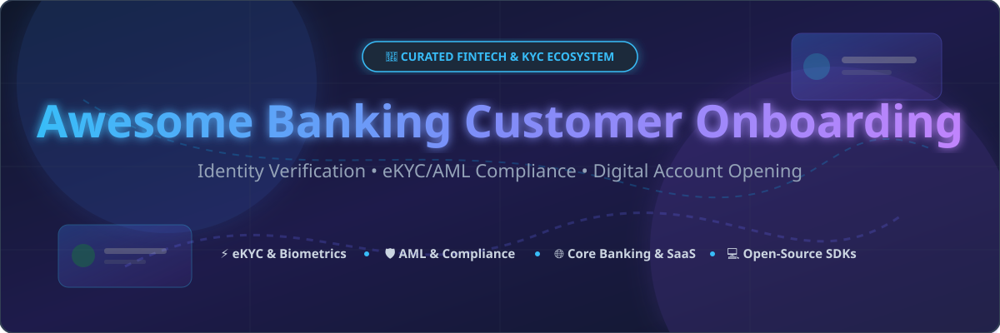

# 🏦 Awesome Banking Customer Onboarding



<p center>
  <a href="https://github.com/ishandutta2007/Awesome-Awesome-Awesome"></a><a href="https://discord.gg/jc4xtF58Ve"></a>
  <a href="https://github.com/ishandutta2007/Awesome-Banking-Customer-Onboarding/stargazers"></a>
  <a href="https://github.com/ishandutta2007/Awesome-Banking-Customer-Onboarding/network/members"></a>
  <a href="https://github.com/ishandutta2007/Awesome-Banking-Customer-Onboarding/pulls"></a>
  <a href="https://github.com/ishandutta2007"></a>
</p>

---

## 📌 Executive Summary & Ecosystem Overview

Welcome to the **Awesome Banking Customer Onboarding** repository — a hand-curated, SEO-optimized directory of market-leading **SaaS Platforms** and **Open-Source Software** for **Banking Customer Onboarding**, **Identity Verification (IDV)**, **Know Your Customer (KYC)**, **Anti-Money Laundering (AML)** compliance, and **Digital Account Opening (DAO)**.

Whether you are a fintech developer building vendor-independent eKYC orchestration pipelines, a banking software engineer evaluating core engines, or a compliance officer reducing customer drop-off, this guide covers the top enterprise tools and self-hosted building blocks available today.

---

## 📑 Table of Contents

- [☁️ SaaS & Hosted Platforms](#️-saas--hosted-platforms)
- [💻 Open-Source GitHub Projects](#-open-source-github-projects)
- [🧩 Architecture & Framework Guidance](#-architecture--framework-guidance)
- [🤝 How to Contribute](#-how-to-contribute)
- [💖 Support & Sponsorship](#-support--sponsorship)
- [📈 Star History](#-star-history)
- [⚖️ Legal & Regulatory Disclaimer](#️-legal--regulatory-disclaimer)

---

## ☁️ SaaS & Hosted Platforms

> 💡 **Market Size & Industry Dynamics**: The global digital banking customer onboarding software market is valued at **$3.1 Billion in 2026** and is projected to reach **$5.43 Billion by 2030** (growing at a **15% CAGR**). The sector is **moderately fragmented**, featuring a mix of comprehensive Client Lifecycle Management (CLM) behemoths (e.g., Fenergo, Persona, Trulioo), specialized biometric identity providers, and niche compliance platforms.

Below is the structured list of leading enterprise SaaS solutions, **sorted by Company Size (Valuation / Revenue) in descending order**:

| 🏢 Platform | 📝 Key Capabilities & Focus | 💰 Specific Starting Pricing | 🎁 Free Tier / Free Trial Limits | 📊 Company Size (Valuation / Revenue) |
| :--- | :--- | :--- | :--- | :--- |
| **[Fenergo](https://www.fenergo.com/)** | End-to-end Client Lifecycle Management (CLM), digital account opening, automated KYC/AML, and multi-jurisdiction regulatory compliance for Tier-1 banks. | Enterprise subscription starting at ~$15,000 / month | 14-day evaluation sandbox environment with limited test API keys | **$2.70 Billion Valuation** (€149.4M Revenue) |
| **[Persona](https://withpersona.com/)** | Configurable identity infrastructure offering automated document verification, facial biometrics, graph-based fraud analysis, and custom workflows. | Essential Plan starting at $250 / month (annual contract) | **Starter Plan free forever** (up to 500 free identity verifications / month) | **$2.00 Billion Valuation** ($100M+ ARR) |
| **[Trulioo](https://www.trulioo.com/)** | Global identity verification platform covering 195+ countries with utility data, credit bureau matching, watchlists, and document verification APIs. | Pay-as-you-go starting at $0.80 / verification ($500 / month minimum) | 14-day free trial environment with up to 100 test verification credits | **$1.75 Billion Valuation** (~$100M Revenue) |
| **[Onfido](https://onfido.com/)** *(by Entrust)* | AI-native document capture, facial liveness verification, and risk-based eKYC orchestration for high-volume banking applications. | Tiered plan starting at $1.20 / verification ($1,000 / month minimum) | 30-day developer sandbox trial with 50 free test checks | **$400 Million Valuation** ($150M ARR; Entrust parent $800M+ Rev) |
| **[Mitek Systems](https://www.miteksystems.com/)** *(NASDAQ: MITK)* | Mobile check deposit, document capture SDKs, driver license/passport verification, and facial biometric authentication. | Starting at $0.50 per document scan ($1,200 / month contract minimum) | 30-day developer sandbox access with 100 test document scans | **$755 Million Market Cap** ($198M TTM Revenue) |
| **[OneSpan](https://www.onespan.com/)** *(NASDAQ: OSPN)* | Digital agreements, e-signatures, high-assurance identity verification, and multi-factor authentication for financial transactions. | Professional Plan starting at $22 / user / month (billed annually) | 30-day free trial with unlimited e-signatures & developer sandbox | **~$500 Million Market Cap** ($243M Annual Revenue) |
| **[Signicat](https://www.signicat.com/)** | European digital identity specialist providing eID integration (BankID, itsme, etc.), electronic signatures, and eKYC identity hubs. | Starter plan from €149 / month + €0.15 per eID check | **Free forever developer sandbox** environment (100 test transactions / month) | **~$500 Million Valuation** ($100M+ ARR) |
| **[Jumio](https://www.jumio.com/)** | KYX platform combining AI-driven document verification, liveness detection, AML transaction monitoring, and risk scoring. | Starting at $1.50 per verification ($1,000 / month minimum spend) | 14-day sandbox trial with 50 test verifications | **~$500 Million Valuation** ($200M+ Annual Bookings) |
| **[ID-Pal](https://id-pal.com/)** | Plug-and-play, regulatory-compliant identity verification platform designed for rapid deployment in SMEs and commercial banking. | Business plan starting at $299 / month (includes 150 verifications / month) | 14-day free trial with up to 25 verification credits | **~$25 Million Valuation** ($5M–$10M Revenue) |
| **[OpenIAM](https://www.openiam.com/)** | Enterprise identity & access management (IAM) platform with customer portal self-service, OAuth 2.0, SCIM, and automated onboarding. | Enterprise SaaS starting at $2.00 / user / month (250 users minimum) | 30-day full-feature free trial with up to 100 test user accounts | **~$10 Million Valuation** ($3M–$5M Revenue) |

---

## 💻 Open-Source GitHub Projects

Open-source banking solutions provide transparent, self-hosted building blocks for core ledger management, face matching, OCR document parsing, and custom eKYC orchestration pipelines.

Below are the top active open-source projects, **sorted by GitHub Star Count in descending order**. Click on any star badge to view the stargazers page!

| 📦 Repository & Link | ⭐ GitHub Stars | 🛠️ Tech Stack & Focus | 🚀 Overview & Key Features |
| :--- | :--- | :--- | :--- |
| **[apache/fineract](https://github.com/apache/fineract)** | [](https://github.com/apache/fineract/stargazers) | Java, Spring Boot, MySQL | Enterprise core banking backend engine powering **Mifos X**. Provides REST APIs for customer creation, savings/loan lifecycle management, and financial ledgers. |
| **[kby-ai/FaceRecognition-Android](https://github.com/kby-ai/FaceRecognition-Android)** | [](https://github.com/kby-ai/FaceRecognition-Android/stargazers) | C++, Java, Android SDK | On-device face recognition & liveness detection SDK. NIST-FRVT top-ranked offline biometrics for Android eKYC onboarding applications. |
| **[microblink/blinkid-android](https://github.com/microblink/blinkid-android)** | [](https://github.com/microblink/blinkid-android/stargazers) | Java, Kotlin, C++ | AI-driven ID document scanning SDK for Android. Extracts data from passports, driver's licenses, and national ID cards offline. |
| **[LerianStudio/midaz](https://github.com/LerianStudio/midaz)** | [](https://github.com/LerianStudio/midaz/stargazers) | Go, PostgreSQL, Redis | Composable core banking engine with double-entry ledgers, organization & account onboarding, PII encryption, and real-time CEL rule checks. |
| **[FaceOnLive/ID-Card-Passport-Recognition-SDK-Android](https://github.com/FaceOnLive/ID-Card-Passport-Recognition-SDK-Android)** | [](https://github.com/FaceOnLive/ID-Card-Passport-Recognition-SDK-Android/stargazers) | Kotlin, C++, Android | On-device document OCR & passport recognition SDK for automated identity check flows in digital banking apps. |
| **[openware/barong](https://github.com/openware/barong)** | [](https://github.com/openware/barong/stargazers) | Ruby, Rails, PostgreSQL | OAuth 2.0 / OIDC authentication server with built-in multi-step KYC verification state machine and admin approval tools. |
| **[Crystal-Bank/crystalbank](https://github.com/Crystal-Bank/crystalbank)** | [](https://github.com/Crystal-Bank/crystalbank/stargazers) | Crystal, Svelte, PostgreSQL | Event-sourced core banking engine with native customer onboarding for natural persons & corporations, maker-checker workflows, and audit logs. |
| **[Ayushkush1/digital-onboarding-platform](https://github.com/Ayushkush1/digital-onboarding-platform)** | [](https://github.com/Ayushkush1/digital-onboarding-platform/stargazers) | Next.js, Supabase, Tailwind | Modern web MVP for digital financial onboarding, KYC document upload, credit risk scoring, and admin workflow dashboards. |
| **[fashkl/eKYC](https://github.com/fashkl/eKYC)** | [](https://github.com/fashkl/eKYC/stargazers) | Java 21, Spring Boot 3 | Spring Boot microservice orchestrator coordinating document verification, face match, address checks, and sanctions screening. |
| **[MuindiStephen/onboarding-customers-api](https://github.com/MuindiStephen/onboarding-customers-api)** | [](https://github.com/MuindiStephen/onboarding-customers-api/stargazers) | Java, Spring Boot, PostgreSQL | Customer sign-up and onboarding REST API with email token verification, JWT authentication, and Docker Compose deployment scripts. |
| **[madeindigio/FintechPlayer](https://github.com/madeindigio/FintechPlayer)** | [](https://github.com/madeindigio/FintechPlayer/stargazers) | TypeScript, React, Swan BaaS | Neobank template with dual individual/corporate account opening wizards built on top of BaaS APIs and compliance sandboxes. |

---

## 🧩 Architecture & Framework Guidance

Building an enterprise-grade digital customer onboarding pipeline typically requires integrating three primary architectural layers:

```
[ Customer Mobile / Web UI ]
            │
            ▼
┌─────────────────────────────────────────────────────────┐
│ 1. Frontend Wizard & UX (e.g. React / Next.js / Mobile) │
└───────────────────────────┬─────────────────────────────┘
                            │
                            ▼
┌─────────────────────────────────────────────────────────┐
│ 2. eKYC & Orchestration Middleware (e.g. Java / Go API)  │
│    ├── Document OCR & AI Liveness (Microblink / KBY-AI) │
│    ├── Sanctions & Watchlist Screening (AML APIs)       │
│    └── Decision Engine (APPROVED / REJECTED / REVIEW)  │
└───────────────────────────┬─────────────────────────────┘
                            │
                            ▼
┌─────────────────────────────────────────────────────────┐
│ 3. Core Banking & Double-Entry Ledger (Fineract/Midaz)  │
└─────────────────────────────────────────────────────────┘
```

1. **Core Banking Layer**: Use **Apache Fineract** or **Lerian Midaz** to manage ledger accounts, user permissions, and multi-tenant banking data.
2. **Orchestration Layer**: Deploy an eKYC service (e.g., **fashkl/eKYC**) to coordinate third-party background screening, AML sanctions lookup, and document scoring.
3. **Identity Capture SDKs**: Integrate on-device libraries like **Microblink BlinkID** or **KBY-AI FaceRecognition** to perform zero-latency document parsing and liveness detection on mobile devices.

---

## 🤝 How to Contribute

Contributions are warmly welcomed! Help keep this curated list accurate and up to date for the global fintech engineering community.

1. **Fork** this repository.
2. **Add or update** entries in `README.md` following the tabular format.
3. Ensure all descriptions are factual, links are working, and specific pricing/free-tier details are verified.
4. Submit a **Pull Request (PR)** with a clear summary of your changes.

For major updates or list recommendations, feel free to join our community on [](https://discord.gg/jc4xtF58Ve) or check out our master collection at [Awesome-Awesome-Awesome](https://github.com/ishandutta2007/Awesome-Awesome-Awesome).

---

## 💖 Support & Sponsorship

If you find this repository helpful for your fintech projects, software research, or compliance architecture, please consider supporting the project!

- ⭐ **Star this repository** to help others discover it on GitHub!
- 🔀 **Fork it** to customize it for your internal team or engineering stack.
- 📢 **Share it** with fellow banking engineers, fintech developers, and compliance leaders.
- ☕ **Buy me a coffee**: Support ongoing open-source maintenance via the [GitHub Sponsor Dashboard](https://github.com/sponsors/ishandutta2007).

Thank you for being part of the open banking community! ❤️

---

## 📈 Star History

[](https://star-history.dera.page/#ishandutta2007/Awesome-Banking-Customer-Onboarding&type=date&legend=top-left)

---

## ⚖️ Legal & Regulatory Disclaimer

- This list is **community-curated** for educational, informational, and architectural research purposes only. It does not constitute formal legal, financial, or compliance advice.
- Customer onboarding solutions deployed in production must comply with international and local regulations, including **FATF Recommendations**, **EU 5AMLD/6AMLD**, **USA PATRIOT Act**, **GDPR**, and local banking commission guidelines.
- Self-hosted biometrics and identity data handling require rigorous encryption at rest and in transit, zero-trust network boundaries, and continuous vulnerability monitoring.
